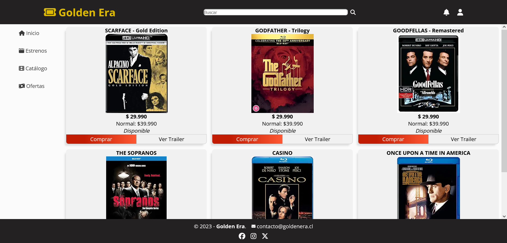

# Desafío 4 - Prueba - Animaciones en CSS

¡Hola! 👋

En este desafío, he trabajado en el diseño de una página web para una tienda a la cual llamé Golden Era. Utilicé media queries y breakpoints para crear tres layouts diferentes: uno para dispositivos móviles, otro para tabletas y ,por último, uno para equipos de mayor tamaño.

## Descripción del Proyecto 🚗

Diseñé la página web con tres layouts distintos: para lograrlo utilicé CSS Grid y Flexbox para organizar las diferentes secciones de la página.

## Resultado Final 🎉

¡Aquí está el resultado final de mi proyecto!

### Observaciones y Recomendaciones 🧐

- La página cuenta con un menú de navegación, una sección de filtros de búsqueda, una sección principal para mostrar los productos y un pie de página.
- Se utilizó CSS Grid y Flexbox para lograr un diseño responsivo y atractivo.
- La página se divide en cuatro secciones: navegación, encabezado, contenido principal y pie de página.

## Experiencia del Desarrollo 🛠️

Durante este proyecto, apliqué mis conocimientos de media queries y breakpoints para crear un diseño responsivo.
